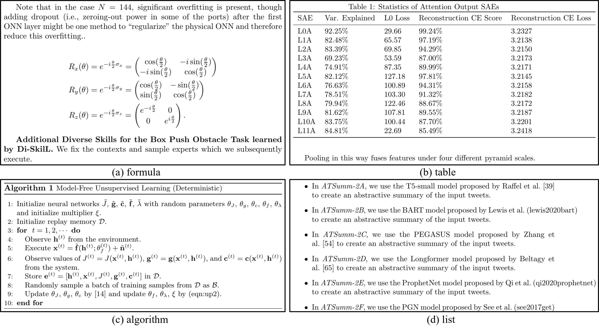
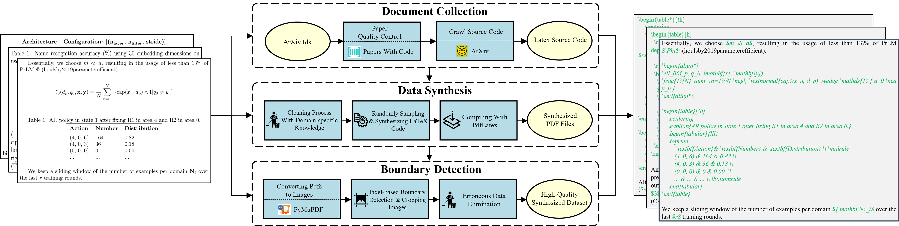

<p align="center">
  
  <h3 align="center">
    AceParse: A Comprehensive Dataset with Diverse Structured Texts for Academic Literature Parsing
  </h3>
  <p align="center">
    <a href=''></a> 
    <a href="https://github.com/JHW5981/AceParse/LICENSE"></a>
    <a href=''></a>  
    <a href=''></img></a>
  </p>
</p>

This is the official repository for AceParse, a comprehensive dataset with diverse structured texts for academic literature parsing.

Project page: https://github.com/JHW5981/AceParse/

## Overview
AceParse includes various types of structured text, such as formulas, tables, algorithms, lists, and sentences embedded with mathematical expressions, among others. We provide examples of several dataset samples to give you a better understanding of our dataset.



Above, we have provided document images in AceParse that contain different types of structured text. The parsing results of the aforementioned images are marked using LaTeX. For detailed examples, refer to `./dataset/samples`.

## Data Engine
The following figure illustrates the construction process of our dataset.



To generate a dataset using our data engine, you need to run

```
python ./dataset/download_source.py --request_num 2 --arxiv_ids ./dataset/arxiv_ids.txt --source_path ./dataset/downloads --tex_path ./dataset/TEX
```

After the code execution is completed, we will obtain a TEX folder under the `./dataset` directory, which contains the LaTeX source code of academic literature. Then, run

```
python ./dataset/synthesize_latex.py --tex_path ./dataset/TEX --save_file ./dataset/SYNS_TEX --length_options 1400,1600,1800 --total_files 10 --files_per_shard 10
```

After this, we obtain the synthesized LaTeX code, which is located in the `./dataset/SYNS_TEX` folder. Then, run

```
bash ./dataset/generate_pdfs.sh ./dataset/SYNS_TEX ./dataset/SYNS_PDF 
```

After this, we obtain the compiled PDFs, which are located in the `./dataset/SYNS_PDF` folder. Then, run

```
python ./dataset/crop_images.py --pdf_path ./dataset/SYNS_PDF --save_path ./dataset/IMAGE 
```

We obtain the final document images, which are located in the `./dataset/IMAGE` folder.

Run

```
python ./dataset/split_dataset.py --save_imgs ./dataset/data/images --save_labels ./dataset/data/labels --tex_path ./dataset/SYNS_TEX --img_path ./dataset/IMAGE
```

This will generate the paths for the training, validation, and test set images, along with the corresponding parsed text. The generated path files are located in the `./dataset/data` directory.

Finally, the organization of our dataset is as follows:

```
dataset/
├── downloads/ # original source files
├── TEX/ # .tex extracted from source
├── SYNS_TEX/ # synthesized .tex files
├── SYNS_PDF/ # pdfs after compiling synthesized .tex
├── IMAGE/ # .png images cropped from synthesized .pdf 
├── data/
│   ├── images/ # image paths
│   └── labels/ # tex label paths
└── samples # samples of AceParse
```

## Example of Loading and Displaying the Data

We have uploaded the AceParse dataset to Hugging Face. You can directly import our dataset using the following code:

## Training

## Evaluation

## Citation

```
@misc{huawei2024aceparse,
      title={AceParse: A Comprehensive Dataset with Diverse Structured Texts for Academic Literature Parsing}, 
      author={Huawei Ji and Cheng Deng and Bo Xue and Zhouyang Jin and Jiaxin Ding and Xiaoying Gan and Luoyi Fu and Xinbing Wang and Chenghu Zhou},
      year={2024},
      eprint={2409.},
      archivePrefix={arXiv},
      primaryClass={cs.CL}
}
```

## Acknowledgments

This repository builds on top of the [Florence-2](https://huggingface.co/microsoft/Florence-2-base/tree/main) repository.
